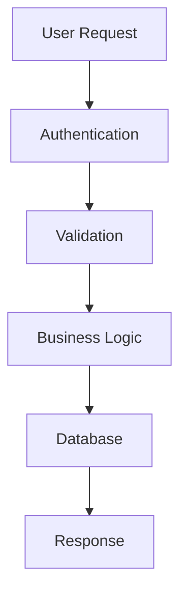

# 📋 Documentation Templates

Standardized templates for creating consistent, high-quality documentation across the Idling.app project.

## 🎯 Template Purpose

Templates ensure:

- **Consistency**: Uniform structure across all documentation
- **Completeness**: All necessary sections are included
- **Quality**: Professional and comprehensive documentation
- **Efficiency**: Faster documentation creation process

## 📚 Available Templates

### [Pull Request Template](pull_request_template/)

Standardized pull request description format:

- **Summary**: Clear description of changes
- **Type of Change**: Feature, fix, docs, etc.
- **Testing**: Testing approach and coverage
- **Checklist**: Pre-merge verification steps
- **Screenshots**: Visual changes documentation
- **Breaking Changes**: Impact assessment

### [Feature Documentation Template](feature-template/)

Template for documenting new features:

- **Overview**: Feature description and purpose
- **User Stories**: Use cases and scenarios
- **Technical Specification**: Implementation details
- **API Documentation**: Endpoint specifications
- **Testing Strategy**: Test coverage and scenarios
- **Deployment Notes**: Release considerations

### [Component Documentation Template](component-template/)

Template for React component documentation:

- **Component Overview**: Purpose and usage
- **Props Interface**: TypeScript prop definitions
- **Usage Examples**: Code examples and demos
- **Styling Guidelines**: CSS and theme integration
- **Accessibility**: WCAG compliance notes
- **Testing Examples**: Unit and integration tests

### [API Endpoint Template](api-template/)

Template for API endpoint documentation:

- **Endpoint Description**: Purpose and functionality
- **Request/Response**: Schema and examples
- **Authentication**: Required permissions
- **Error Handling**: Error codes and messages
- **Rate Limiting**: Usage restrictions
- **Examples**: cURL and SDK examples

## 🔧 Template Usage

### 1. Choose Template

Select the appropriate template for your documentation type:

```bash
# Copy template to your documentation location
cp DOCS/templates/feature-template.md your-feature-docs.md
```

### 2. Customize Content

Replace placeholder content with your specific information:

- Update title and description
- Fill in all required sections
- Add relevant examples and code snippets
- Include necessary diagrams or screenshots

### 3. Review Checklist

Before publishing, ensure:

- [ ] All sections are completed
- [ ] Code examples are tested
- [ ] Links are valid and working
- [ ] Grammar and spelling are correct
- [ ] Formatting follows style guide

## 📝 Writing Guidelines

### Content Structure

#### Clear Headings

Use descriptive, hierarchical headings:

```markdown
# Main Title

## Major Section

### Subsection

#### Detail Section
```

#### Consistent Formatting

- **Bold** for emphasis and labels
- `Code` for inline code and filenames
- _Italic_ for quotes and references
- Lists for step-by-step instructions

#### Code Examples

Always include working code examples:

```typescript
// Good: Complete, working example
interface UserProps {
  id: string;
  name: string;
  email: string;
}

function UserCard({ id, name, email }: UserProps) {
  return (
    <div className="user-card">
      <h3>{name}</h3>
      <p>{email}</p>
    </div>
  );
}
```

### Writing Style

#### Voice and Tone

- **Professional**: Clear and authoritative
- **Helpful**: Supportive and encouraging
- **Concise**: Direct and to the point
- **Inclusive**: Accessible to all skill levels

#### Technical Accuracy

- Verify all code examples work
- Test all instructions step-by-step
- Keep documentation up-to-date
- Link to authoritative sources

## 🎨 Visual Elements

### Diagrams and Charts

Use Mermaid for technical diagrams:



### Screenshots and Images

Include visual aids when helpful:

- UI screenshots for user-facing features
- Architecture diagrams for system design
- Flowcharts for complex processes
- Before/after comparisons for changes

### Code Syntax Highlighting

Use appropriate language tags:

```bash
# Terminal commands
npm install package-name
```

```json
{
  "config": "value",
  "setting": true
}
```

```sql
SELECT * FROM users WHERE active = true;
```

## 📊 Template Maintenance

### Regular Updates

Templates are reviewed and updated:

- **Monthly**: Minor improvements and fixes
- **Quarterly**: Major structure updates
- **Annually**: Complete template overhaul

### Version Control

All templates are version controlled:

- Track changes and improvements
- Maintain backward compatibility
- Document breaking changes
- Provide migration guides

### Community Feedback

Template improvements come from:

- User feedback and suggestions
- Best practice research
- Industry standard updates
- Team retrospectives

## 🔗 Related Resources

### Style Guides

- **[Writing Style Guide](../community/standards/docs/)** - Writing conventions
- **[Code Style Guide](../community/standards/code/)** - Code formatting rules
- **[Design System](../dev/components/library/)** - UI component guidelines

### Tools

- **[Markdown Guide](https://www.markdownguide.org/)** - Markdown syntax reference
- **[Mermaid Documentation](https://mermaid-js.github.io/)** - Diagram syntax
- **[Docusaurus Documentation](https://docusaurus.io/docs)** - Modern documentation site generator

### Examples

- **[API Documentation](../docs/api/)** - Real API documentation examples
- **[Component Library](../dev/components/)** - Component documentation examples
- **[Architecture Docs](../docs/architecture/)** - Technical documentation examples

## 🚀 Getting Started

1. **Choose Template**: Select the appropriate template for your needs
2. **Copy Template**: Create a new file from the template
3. **Customize Content**: Fill in your specific information
4. **Review Guidelines**: Follow the writing and formatting guidelines
5. **Submit for Review**: Get feedback before publishing
6. **Publish**: Add to the documentation site

---

_Templates are continuously improved based on team feedback and best practices. Last updated: January 28, 2025_
